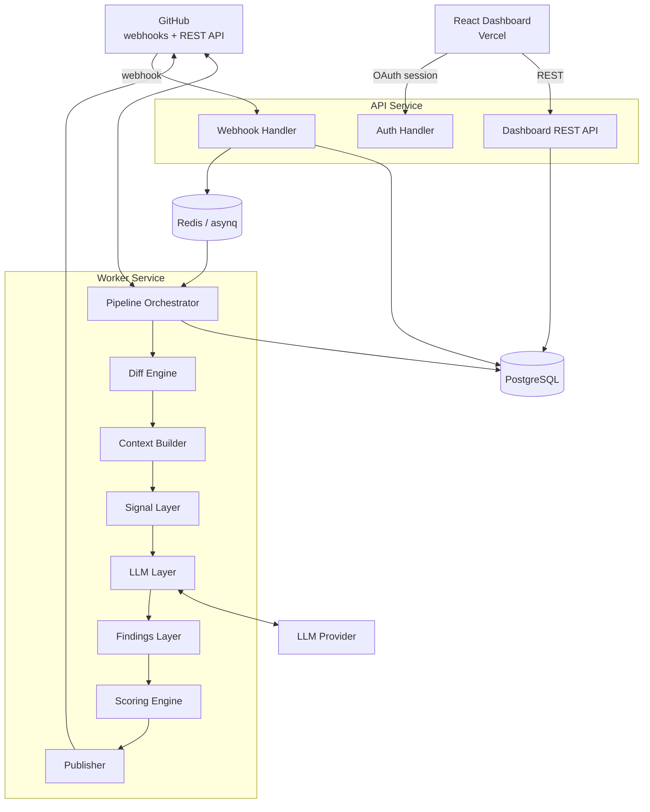
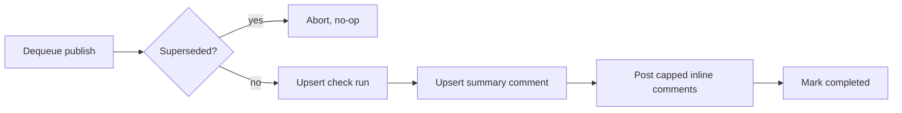
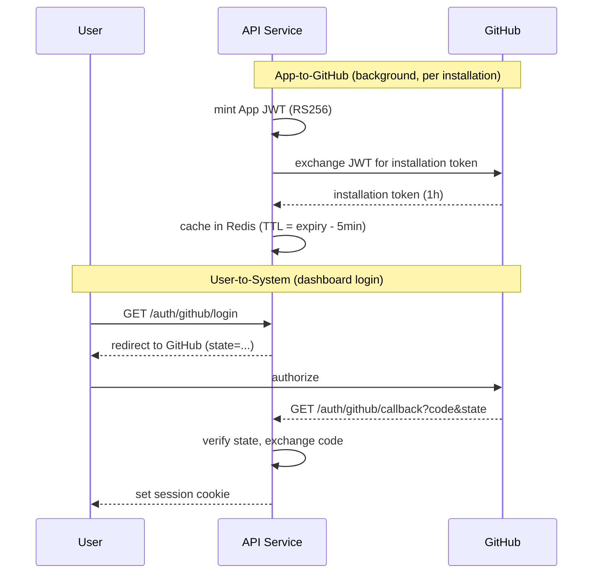
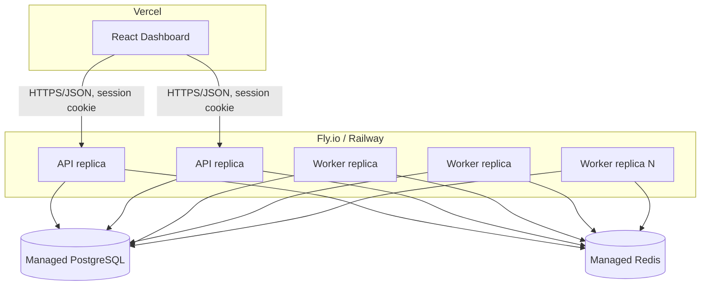

# High-Level Design — GitHub PR Risk Analyzer

**Derived from:** [PRD.md](./PRD.md) · **Source of truth:** [`../pr-risk-analyzer-plan.md`](../pr-risk-analyzer-plan.md) §1, §2, §5, §8, §10, §11
**Related:** [database-design.md](./database-design.md) · [API.md](./API.md) · [LLD.md](./LLD.md) · [security.md](./security.md) · [architecture-decisions.md](./architecture-decisions.md)

---

## 1. System Overview

The system is a GitHub App backed by two independently deployable Go services sharing one codebase — an **API service** and a **Worker service** — plus a React dashboard. GitHub is the sole trigger (webhooks) and sole publish target (Checks/Reviews API); an external LLM provider supplies one input signal among several. PostgreSQL is the system of record; Redis is transient queue/cache state only, safe to lose.

This is a **modular monorepo**, not a microservices system: one Go module, two binaries (`cmd/api`, `cmd/worker`), separated because they have different latency requirements and failure blast radii — not because the domain requires independent service boundaries. `plan.md` does not describe or require a microservices decomposition, so none is introduced (see [architecture-decisions.md](./architecture-decisions.md#adr-003-two-services-api-worker-not-microservices)).

## 2. Architecture Style

**Event-driven, queue-mediated, two-tier processing** with a clear synchronous/asynchronous split:

- **Synchronous tier (API service):** stateless HTTP handlers behind Gin. Handles webhook receipt, signature verification, and the dashboard's read/write REST API. No business logic beyond validation, persistence of raw input, and enqueueing.
- **Asynchronous tier (Worker service):** a pool of task handlers consuming from Redis via `asynq`. Owns the entire analysis pipeline and all outbound calls to GitHub (for data) and the LLM provider.

This split exists because of one hard constraint from `plan.md` §1: GitHub times out webhook deliveries at 10 seconds and retries on timeout, so nothing expensive can run inline with the webhook.

## 3. Major Components

| Component | Responsibility | Explicitly not responsible for |
|---|---|---|
| Webhook Handler | Signature verification, delivery dedup, event persistence, routing, enqueue | Any GitHub data fetching, any LLM calls, any analysis |
| Auth Handler | OAuth login/callback, session issuance | Business data access (delegates to Dashboard REST API) |
| Dashboard REST API | Tenant-scoped reads of reviews/findings/analytics, settings writes, rerun trigger | Any analysis logic |
| Pipeline Orchestrator | Stage sequencing, timeouts, state transitions, failure classification | Knowing how any individual stage works internally |
| Diff Engine | Unified diff parsing, line→position mapping, file classification | Fetching anything |
| Context Builder | File/neighbor selection, content fetch, redaction, token budgeting | Prompting |
| Signal Layer | Deterministic heuristics (churn, sensitive paths, deps, test gaps, secrets) | Anything probabilistic |
| LLM Layer | Provider abstraction, prompts, structured-output parsing, model routing | Scoring, publishing |
| Findings Layer | Schema validation, evidence anchoring, dedupe, confidence calibration | Generating findings |
| Scoring Engine | Pure scoring function, banding, versioning | Any I/O |
| Publisher | Check run lifecycle, comment upsert, inline comments, dry-run | Deciding what's risky |
| GitHub Client (shared) | App auth, installation tokens, REST calls, pagination, rate-limit handling | Interpreting diffs, deciding what to post |
| Store (shared) | Repositories, transactions, tenant scoping | Business rules |

Full package-level interfaces for each component are in [LLD.md](./LLD.md#1-packagemodule-structure).

## 4. Communication Between Components

- **API ↔ Redis:** enqueue only (`asynq.Client`), fire-and-forget from the API's perspective.
- **API ↔ PostgreSQL:** direct reads/writes via the shared `store` package; the API never queries `findings`/`reviews` without an `installation_id` scope.
- **Redis ↔ Worker:** `asynq.Server` pulls tasks; task payloads are the only data passed between API and Worker — the worker re-derives everything else from the database and GitHub, so payloads stay small and stable across schema changes.
- **Worker ↔ GitHub:** all outbound REST calls (diff/file fetch, check runs, comments) go through the shared `github` client package, which owns token minting/caching and rate-limit backoff.
- **Worker ↔ LLM Provider:** exclusively through the `llm.Provider` interface; no other component calls an LLM directly.
- **Worker ↔ PostgreSQL:** all pipeline state and results persist through `store`, in a single transaction per review-completion boundary.
- **Dashboard ↔ API:** HTTPS/JSON only, authenticated via session cookie, CORS-restricted to the deployed frontend origin.

No component calls another service's internals directly; all cross-component contracts are either a Go package interface (in-process, same binary family) or an external protocol (HTTP, Redis wire protocol) with a stable, versioned payload shape.

## 5. Data Flow

### 5.1 Ingestion (synchronous, target < 1s)

```mermaid
flowchart LR
    A[GitHub webhook] --> B[Verify HMAC]
    B --> C[Dedupe on delivery ID]
    C --> D[Persist webhook_event]
    D --> E[Upsert installation/repo/PR]
    E --> F[Derive idempotency key]
    F --> G[Enqueue review:analyze]
    G --> H[Insert reviews row: queued]
    H --> I[Return 202]
```

### 5.2 Analysis (asynchronous, target ~60s standard mode)

```mermaid
flowchart LR
    A[Dequeue] --> B[Mark running]
    B --> C[Fetch diff + files]
    C --> D[Parse + classify + position map]
    D --> E[Deterministic signals]
    E --> F[Budgeted context build]
    F --> G[Model routing by complexity]
    G --> H[Map: parallel chunk analysis]
    H --> I[Reduce: synthesis]
    I --> J[Validate + anchor + dedupe + calibrate]
    J --> K[Score - pure function]
    K --> L[Persist]
    L --> M[Enqueue review:publish]
```

### 5.3 Publish (independently retryable)

Full sequence diagrams for each end-to-end flow (including failure paths) are in [user-flows.md](./user-flows.md).

## 6. External Services

| Service | Direction | Purpose | Notes |
|---|---|---|---|
| GitHub REST/Webhooks/Checks/Reviews API | Inbound (webhooks) + Outbound (data fetch, publish) | Sole trigger and sole publish target | GitHub App auth only (`plan.md` §5, §10) |
| LLM Provider | Outbound | Structured finding generation | Provider-agnostic interface; no-training-tier required (`plan.md` §10) |
| Redis (managed) | Internal | Queue (`asynq`), installation-token cache, supersession flags | Transient — safe to lose, not a system of record |
| PostgreSQL (managed) | Internal | System of record | See [database-design.md](./database-design.md) |

## 7. Authentication Flow

Two distinct authentication mechanisms exist, serving different actors:

1. **GitHub App authentication (system-to-GitHub):** App JWT (RS256, ≤10 min expiry, signed with the App's private key) exchanged for a per-installation access token (1-hour lifetime), cached in Redis, refreshed on `401`. Used by the Worker and API for every outbound GitHub call. Never a PAT, in any environment. (`plan.md` §5 "Token strategy")
2. **Dashboard OAuth (user-to-system):** standard OAuth 2.0 authorization-code flow against GitHub, with `state`-parameter CSRF protection, resulting in a signed `HttpOnly`/`Secure`/`SameSite=Lax` session cookie. Used by human users of the dashboard only. (`plan.md` §4 "Auth", §9 "Concepts to learn")

Full detail in [security.md](./security.md#authentication).

## 8. Main Request Lifecycle

The dominant lifecycle is not a dashboard HTTP request but the **webhook-triggered review lifecycle**, since that is the system's core function:

`GitHub event → API (verify/persist/enqueue, <1s) → Worker (analyze, ~60s) → Worker (publish) → GitHub (check run + comments visible)`

Dashboard HTTP requests are a conventional synchronous read path: `Browser → API (session check, tenant scope) → PostgreSQL → JSON response`, with no queue involvement. See [API.md](./API.md) for every endpoint's contract.

## 9. Background Processing

All PR analysis is background processing by design (§1, rule 1). The task types, in `plan.md` §8:

| Task | Queue | Timeout | Max retries |
|---|---|---|---|
| `review:analyze` | `critical` (manual) / `default` (auto) | 8 min | 3 |
| `review:publish` | `default` | 2 min | 5 |
| `repo:sync_config` | `low` | 1 min | 3 |
| `repo:compute_file_stats` | `low` | 5 min | 2 |
| `maintenance:reap_stale` | scheduled, every 5 min | — | — |

`review:analyze` and `review:publish` are deliberately separate tasks so a transient comment-posting failure never re-triggers an expensive LLM run (`plan.md` §16 item 8). Full task payload shapes are in [LLD.md](./LLD.md#9-queue-task-definitions-reference).

## 10. Error Handling (system level)

Every error crossing an external-call boundary (GitHub client, LLM provider) is classified once, at that boundary, into one of three classes, and the classification determines all downstream behavior:

| Class | Behavior |
|---|---|
| Retryable | Exponential backoff with jitter, up to the task's max retries |
| Terminal | Fail fast, mark review `failed`, do not retry |
| Degradable | Continue with reduced scope, record `degraded_reason`, still deliver a result |

The system is designed so that **almost no failure mode produces nothing** — see the degradation ladder in `plan.md` §11 and [Flow 5](./user-flows.md#flow-5--degraded-review-when-the-llm-is-unavailable-mvp). Every check run is guaranteed to reach a terminal conclusion via a `defer` in the worker plus a scheduled stale-review reaper. Full classification tables and package-level error types are in [LLD.md](./LLD.md#6-error-handling) and [security.md](./security.md).

## 11. Scalability Considerations

- **API and Worker scale independently.** Webhook traffic is bursty but cheap; analysis is steady-state but expensive (LLM/GitHub latency-bound). Each is a separate deployable that can be replicated on its own axis.
- **Worker concurrency is bounded, not maximized.** Default concurrency per replica is 5, because the bottleneck is external call latency, not local CPU (`plan.md` §8, §13 Phase 2). Scaling out means adding worker replicas, not raising per-replica concurrency unboundedly.
- **Queue priorities prevent starvation without hard partitioning.** Weighted (non-strict) priority (`critical:6, default:3, low:1`) lets manual/slash-command reviews jump ahead of routine automatic ones without a fully separate queue infrastructure.
- **Database growth is bounded by retention policy**, not indefinite accumulation of raw LLM responses/diffs (see [database-design.md](./database-design.md#data-lifecycle-and-retention)).
- **Analytics aggregation** is a plain SQL path first; a materialized view is introduced only if query latency crosses ~200ms with realistic data volume (`plan.md` §13 Phase 10) — no premature optimization.
- **Cost, not raw throughput, is the primary scaling constraint** for this system: model routing (cheap-first, escalate-on-signal) and per-tenant/global budget caps exist specifically because LLM calls, not compute, are the expensive resource (`plan.md` §6 Stage 5, §10).

## 12. Deployment Architecture

Two binaries (`cmd/api`, `cmd/worker`) built from one Go module, deployed as separate services with independent replica counts and health checks. Postgres and Redis are managed services with backups (Postgres) and persistence (Redis) enabled. The frontend deploys separately to Vercel and talks to the API service exclusively over HTTPS/JSON — it never has direct database, queue, or LLM access. (`plan.md` §1 "Stack decisions", §13 Phase 12)

## 13. What This Document Deliberately Omits

Database column-level detail lives in [database-design.md](./database-design.md). Endpoint-level API contracts live in [API.md](./API.md). Package interfaces, algorithms (position mapping, scoring formula, confidence calibration), and state machine transition tables live in [LLD.md](./LLD.md). This document should remain accurate even if every one of those details changes.
