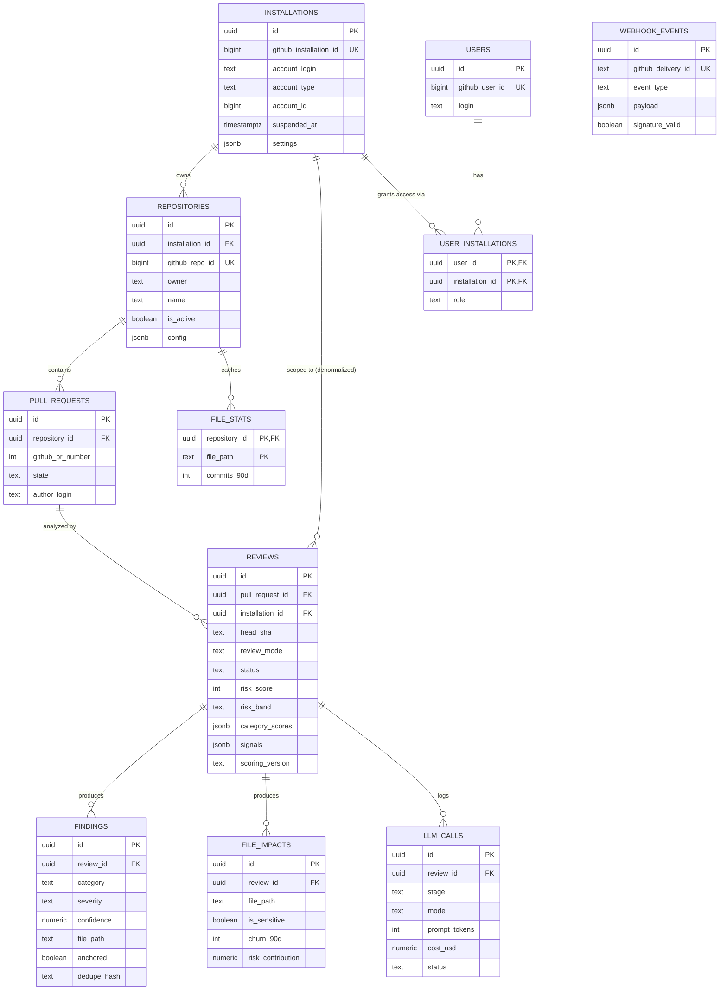

# Database Design — GitHub PR Risk Analyzer

**Derived from:** [HLD.md](./HLD.md) · **Source of truth:** [`../pr-risk-analyzer-plan.md`](../pr-risk-analyzer-plan.md) §3
**Related:** [API.md](./API.md) · [LLD.md](./LLD.md) · [security.md](./security.md#database-security)

---

## 1. Database Choice and Reasoning

**PostgreSQL**, not MongoDB. `plan.md` §1 states this explicitly: *"Pick Postgres, not Mongo. Findings and analytics need joins, aggregates, and constraints. `JSONB` covers the schemaless parts."*

Concretely:
- Dashboard analytics (§4 `analytics/overview`, `analytics/cost`, `analytics/hotspots`) require joins across `reviews`, `findings`, `llm_calls`, and time-bucketed aggregation (`date_trunc`, `percentile_cont`) — native SQL, not application-side aggregation over a document store.
- Idempotency and supersession (§3, §8) depend on a **partial unique index** and **guarded conditional updates** — relational constraints that a document database would require re-implementing in application code, with weaker guarantees.
- The parts of the domain that genuinely are schemaless or evolve independently of releases — `signals`, `category_scores`, `stats`, `settings`, `config` — are stored as `JSONB` columns rather than forcing the whole database into a document model. This gets flexibility exactly where it's needed without giving up relational integrity everywhere else.

Full rationale is recorded as [ADR-001](./architecture-decisions.md#adr-001-postgresql-over-mongodb).

## 2. Entity-Relationship Diagram



`webhook_events` is intentionally not connected by a foreign key to any other table — it is a raw, append-only audit/replay log keyed only by `github_delivery_id`, deliberately decoupled so that a failure interpreting a payload never blocks its persistence (`plan.md` §5 step 4, before routing).

## 3. Tables

Conventions: all timestamps `timestamptz`; app-generated IDs `uuid`; GitHub-native IDs `bigint`. Full column list per table below; purpose stated for every entity per the task's requirement that "every entity should have a clear purpose derived from the requirements."

### 3.1 `installations`
**Purpose:** one row per GitHub App installation; the tenancy root every other table scopes to. (`plan.md` §3)

| Column | Type | Constraints | Notes |
|---|---|---|---|
| `id` | uuid | PK | |
| `github_installation_id` | bigint | UNIQUE NOT NULL | GitHub-native identity |
| `account_login` | text | NOT NULL | |
| `account_type` | text | NOT NULL | `User` \| `Organization` |
| `account_id` | bigint | NOT NULL | |
| `suspended_at` | timestamptz | NULL | set on `installation.suspend` |
| `settings` | jsonb | NOT NULL DEFAULT `{}` | default mode, budget caps, enabled categories |
| `created_at`, `updated_at` | timestamptz | NOT NULL DEFAULT now() | |

### 3.2 `repositories`
**Purpose:** one row per repo the app can act on; carries per-repo config and activation state (FR-093, FR-111).

| Column | Type | Constraints | Notes |
|---|---|---|---|
| `id` | uuid | PK | |
| `installation_id` | uuid | FK → installations | |
| `github_repo_id` | bigint | UNIQUE NOT NULL | |
| `owner`, `name` | text | NOT NULL | UNIQUE (owner, name) |
| `default_branch` | text | | |
| `private` | boolean | NOT NULL | |
| `primary_language` | text | | |
| `is_active` | boolean | NOT NULL DEFAULT true | analysis skipped when false (FR-005) |
| `config` | jsonb | NOT NULL DEFAULT `{}` | parsed `.prrisk.yml` |
| `config_sha` | text | | detects config file changes |
| `created_at`, `updated_at` | timestamptz | | |

### 3.3 `pull_requests`
**Purpose:** one row per PR; the parent of every review for that PR (FR-008).

| Column | Type | Constraints | Notes |
|---|---|---|---|
| `id` | uuid | PK | |
| `repository_id` | uuid | FK → repositories | |
| `github_pr_number` | int | NOT NULL | UNIQUE (repository_id, github_pr_number) |
| `github_pr_id` | bigint | | |
| `title`, `author_login`, `base_branch`, `head_branch`, `url` | text | | |
| `state` | text | | `open` \| `closed` \| `merged` |
| `draft` | boolean | | |
| `opened_at`, `merged_at` | timestamptz | | |
| `created_at`, `updated_at` | timestamptz | | |

### 3.4 `reviews` — the central table
**Purpose:** one row per analysis run; the idempotency and state-machine anchor for the entire pipeline (FR-011–FR-020, FR-056–FR-065).

| Column | Type | Constraints | Notes |
|---|---|---|---|
| `id` | uuid | PK | |
| `pull_request_id` | uuid | FK → pull_requests | |
| `installation_id` | uuid | FK → installations | **denormalized** for tenant scoping on every query without a multi-hop join |
| `head_sha` | text | NOT NULL | |
| `base_sha` | text | | |
| `review_mode` | text | NOT NULL | quick\|standard\|deep\|security\|performance\|tests |
| `trigger` | text | NOT NULL | pr_opened\|pr_synchronize\|manual_command\|reanalysis |
| `status` | text | NOT NULL | queued\|running\|completed\|failed\|skipped\|superseded |
| `risk_score` | int | NULL | 0-100 |
| `risk_band` | text | NULL | low\|moderate\|high\|critical |
| `category_scores` | jsonb | NULL | per-category subscores |
| `signals` | jsonb | NULL | raw deterministic signal values, auditable |
| `scoring_version` | text | NULL | enables offline score recomputation |
| `prompt_version` | text | NULL | |
| `summary_md` | text | NULL | |
| `stats` | jsonb | NULL | files_changed, additions, deletions, truncated flags |
| `degraded_reason` | text | NULL | set when the degradation ladder engaged |
| `error_code`, `error_detail` | text | NULL | |
| `queued_at`, `started_at`, `completed_at` | timestamptz | NULL | |
| `total_duration_ms` | int | NULL | |
| `created_at`, `updated_at` | timestamptz | NOT NULL DEFAULT now() | |

**Constraints:**
```sql
CREATE UNIQUE INDEX reviews_unique_live
  ON reviews (pull_request_id, head_sha, review_mode)
  WHERE status <> 'superseded';           -- idempotency guarantee, FR-012
CREATE INDEX reviews_installation_created ON reviews (installation_id, created_at DESC);
CREATE INDEX reviews_inflight ON reviews (status) WHERE status IN ('queued','running');
```

The partial unique index is the data-layer idempotency guarantee: a redelivered webhook or a duplicate worker cannot create two live reviews for the same commit (`plan.md` §3).

### 3.5 `findings`
**Purpose:** one row per issue surfaced (LLM or deterministic); the unit the publisher and dashboard render (FR-041–FR-050).

| Column | Type | Constraints | Notes |
|---|---|---|---|
| `id` | uuid | PK | |
| `review_id` | uuid | FK → reviews ON DELETE CASCADE | |
| `category` | text | NOT NULL | bug\|security\|performance\|architecture\|test_gap\|style |
| `severity` | text | NOT NULL | info\|low\|medium\|high\|critical |
| `confidence` | numeric(3,2) | NOT NULL | 0.00–1.00, post-calibration |
| `title` | text | NOT NULL | |
| `description_md` | text | NOT NULL | |
| `file_path` | text | NULL | |
| `start_line`, `end_line` | int | NULL | line in HEAD version |
| `diff_position` | int | NULL | resolved GitHub position; null if unanchorable |
| `evidence_snippet` | text | NULL | |
| `suggestion_md` | text | NULL | |
| `source` | text | NOT NULL | llm\|static_analysis\|heuristic\|dependency_scan |
| `rule_id` | text | NULL | for deterministic sources |
| `anchored` | boolean | NOT NULL DEFAULT false | gates inline-comment eligibility |
| `posted_as_comment` | boolean | NOT NULL DEFAULT false | |
| `github_comment_id` | bigint | NULL | |
| `dedupe_hash` | text | NOT NULL | UNIQUE (review_id, dedupe_hash) |
| `created_at` | timestamptz | NOT NULL DEFAULT now() | |

**Indexes:** `(review_id)`, `(review_id, severity)`.

### 3.6 `file_impacts`
**Purpose:** per-file blast-radius data for a review; drives the dashboard's impact view and the blast-radius scoring inputs (FR-031–FR-036).

| Column | Type | Notes |
|---|---|---|
| `id` | uuid PK | |
| `review_id` | uuid FK ON DELETE CASCADE | |
| `file_path` | text NOT NULL | |
| `change_type` | text | added\|modified\|removed\|renamed |
| `additions`, `deletions` | int | |
| `is_test`, `is_generated`, `is_sensitive` | boolean | |
| `sensitivity_reasons` | text[] | auth, payments, migration, ci, infra, public_api |
| `churn_90d` | int | |
| `dependents_count` | int | |
| `related_files` | text[] | neighbors pulled into context |
| `risk_contribution` | numeric(5,2) | |

### 3.7 `llm_calls`
**Purpose:** cost/latency observability for every LLM invocation, including failures — the basis for analytics/cost views and budget enforcement (FR-052, FR-079, FR-096–FR-100).

| Column | Type | Notes |
|---|---|---|
| `id` | uuid PK | |
| `review_id` | uuid FK ON DELETE CASCADE | |
| `stage` | text NOT NULL | chunk_analysis\|synthesis\|escalation\|summary |
| `provider`, `model` | text | model NOT NULL |
| `prompt_tokens`, `completion_tokens`, `cached_tokens` | int | |
| `cost_usd` | numeric(10,6) | |
| `latency_ms` | int | |
| `attempt` | int NOT NULL DEFAULT 1 | |
| `status` | text NOT NULL | ok\|invalid_json\|timeout\|rate_limited\|provider_error |
| `request_fingerprint` | text | hash of prompt, for cache/debug |
| `raw_response_ref` | text | object storage key or truncated inline copy |
| `created_at` | timestamptz | |

**Indexes:** `(review_id)`, `(created_at)`.

### 3.8 `webhook_events`
**Purpose:** raw audit trail and replay-protection source; the mechanism behind FR-002. Deliberately not FK-linked to downstream entities.

| Column | Type | Notes |
|---|---|---|
| `id` | uuid PK | |
| `github_delivery_id` | text UNIQUE NOT NULL | `X-GitHub-Delivery` |
| `event_type`, `action` | text | |
| `installation_id` | bigint | GitHub-native, not FK (event may precede installation upsert) |
| `repo_full_name` | text | |
| `payload` | jsonb NOT NULL | |
| `signature_valid` | boolean NOT NULL | |
| `processed` | boolean NOT NULL DEFAULT false | |
| `enqueued_task_id` | text | |
| `received_at` | timestamptz | |

### 3.9 `users` / `user_installations`
**Purpose:** dashboard authentication and tenant-access mapping (FR-086, FR-087, FR-091).

```sql
CREATE TABLE users (
    id uuid PRIMARY KEY,
    github_user_id bigint UNIQUE NOT NULL,
    login text, avatar_url text, email text,
    created_at timestamptz NOT NULL DEFAULT now()
);
CREATE TABLE user_installations (
    user_id uuid REFERENCES users(id),
    installation_id uuid REFERENCES installations(id),
    role text,
    PRIMARY KEY (user_id, installation_id)
);
```

### 3.10 `file_stats` (optional, Phase 8+)
**Purpose:** cached per-file churn history so churn signal computation doesn't re-query GitHub on every review (FR-035).

```sql
CREATE TABLE file_stats (
    repository_id uuid REFERENCES repositories(id),
    file_path text,
    commits_90d int,
    distinct_authors_90d int,
    last_computed_at timestamptz,
    PRIMARY KEY (repository_id, file_path)
);
```

## 4. Relationships Summary

- `installations 1—N repositories 1—N pull_requests 1—N reviews`
- `reviews 1—N findings`, `reviews 1—N file_impacts`, `reviews 1—N llm_calls` (all `ON DELETE CASCADE` — a review's children have no independent lifecycle)
- `installations N—N users` via `user_installations`
- `reviews.installation_id` is a **denormalized, redundant** FK back to `installations` — redundant relative to `pull_request_id → repository_id → installation_id`, kept specifically so every tenant-scoping query on `reviews`/`findings`/etc. is a single join, not a three-hop traversal (`plan.md` §3 "Design notes").

## 5. Constraints (full list)

- `UNIQUE (owner, name)` on `repositories` — a repo is globally unique by owner/name regardless of installation.
- `UNIQUE (repository_id, github_pr_number)` on `pull_requests`.
- Partial `UNIQUE (pull_request_id, head_sha, review_mode) WHERE status <> 'superseded'` on `reviews` — the idempotency guarantee.
- `UNIQUE (review_id, dedupe_hash)` on `findings` — the deduplication guarantee at the storage layer, backstopping application-level dedup.
- `UNIQUE (github_delivery_id)` on `webhook_events` — the replay-protection guarantee.
- All FKs from `reviews`, `findings` (via `review_id`), `file_impacts`, `llm_calls` are `ON DELETE CASCADE` from their immediate parent, except **reviews are never deleted** by application logic (see §7) — cascade exists for referential correctness, not as an active deletion path.

## 6. Indexes

| Index | Table | Purpose |
|---|---|---|
| `reviews_unique_live` (partial unique) | reviews | Idempotency |
| `reviews_installation_created` | reviews | Dashboard review list, tenant-scoped, sorted by recency |
| `reviews_inflight` (partial) | reviews | Reaper query for stale `running`/`queued` rows |
| `findings_review`, `findings_review_severity` | findings | Findings-by-review fetch and severity filtering |
| `llm_calls_review`, `llm_calls_created` | llm_calls | Per-review cost breakdown; time-ranged cost analytics |
| (V1) `reviews(installation_id, created_at)`, `llm_calls(created_at)`, `findings(review_id, category)` | — | Analytics time-range aggregation (`plan.md` §13 Phase 10) |

## 7. Important Queries

**Tenant-scoped review list (paginated, cursor-based):**
```sql
SELECT id, pull_request_id, head_sha, status, risk_score, risk_band, review_mode, created_at
FROM reviews
WHERE installation_id = $1
  AND ($2::text IS NULL OR status = $2)
  AND ($3::text IS NULL OR risk_band = $3)
  AND created_at < $4  -- cursor
ORDER BY created_at DESC
LIMIT $5;
```

**Guarded state transition (queued → running):**
```sql
UPDATE reviews SET status = 'running', started_at = now()
WHERE id = $1 AND status = 'queued';
-- application checks RowsAffected == 1 before proceeding
```

**Stale-review reaper:**
```sql
UPDATE reviews SET status = 'failed', error_code = 'STALE', completed_at = now()
WHERE status = 'running' AND started_at < now() - interval '10 minutes';
```

**Supersession on new push:**
```sql
UPDATE reviews SET status = 'superseded', updated_at = now()
WHERE pull_request_id = $1 AND status IN ('queued', 'running')
RETURNING id;  -- IDs used to set Redis cancellation flags
```

**Cost by model per day (analytics):**
```sql
SELECT date_trunc('day', created_at) AS day, model, sum(cost_usd) AS total_cost
FROM llm_calls
WHERE review_id IN (SELECT id FROM reviews WHERE installation_id = $1)
  AND created_at BETWEEN $2 AND $3
GROUP BY 1, 2
ORDER BY 1;
```

**Risk hotspots:**
```sql
SELECT file_path, sum(risk_contribution) AS cumulative_risk, count(*) AS appearances
FROM file_impacts
WHERE review_id IN (SELECT id FROM reviews WHERE installation_id = $1)
GROUP BY file_path
ORDER BY cumulative_risk DESC
LIMIT 20;
```

**Cross-tenant access check (used by every single-review fetch):**
```sql
SELECT * FROM reviews WHERE id = $1 AND installation_id = $2;
-- zero rows -> 404, regardless of whether the review exists under a different installation
```

## 8. Data Lifecycle and Retention

Per `plan.md` §10 "Data handling" (exact retention window left unspecified — see [PRD.md Assumption A5](./PRD.md#14-assumptions)):

- **Raw LLM responses and full diffs** (`llm_calls.raw_response_ref`, any cached diff content) expire after a configured retention window (assumed default: 30 days).
- **Findings and scores persist** indefinitely — they are the durable value of the system and are cheap relative to raw LLM payloads.
- **`reviews` rows are never deleted** on force-push; superseded reviews are retained with `status = 'superseded'` as history (`plan.md` §3 "Design notes": *"Never delete reviews on force-push. Mark them superseded. History is a feature."*).
- **Delete-on-uninstall:** `installation.deleted` triggers deletion of that installation's raw LLM responses and diffs immediately (independent of the standard retention window), while aggregate/historical score data may be retained per the installation's data-processing agreement — implementation detail left to the eventual privacy policy, not specified in `plan.md`.
- **`webhook_events.payload`** is retained per the same retention window as raw LLM data, since it can contain full PR diffs in the payload body.

## 9. Migration Strategy

- Versioned, reversible SQL migrations via `golang-migrate` or `goose` (`plan.md` §1, §13 Phase 0).
- Every migration has both an `up` and a `down`; CI verifies both directions apply cleanly against a fresh database (`plan.md` §12 "Integration" tests: "Migrations up and down cleanly").
- Schema evolves ahead of code where safe (additive columns/tables first), so the deploy pipeline can run migrations before the new binary starts, and old and new code can briefly coexist during a rolling deploy (`plan.md` §13 Phase 12).
- `JSONB` columns (`signals`, `category_scores`, `stats`, `settings`, `config`) absorb most schema evolution for evolving-shape data without requiring a migration per field change — this is precisely why they're JSONB rather than normalized columns (`plan.md` §3 "Design notes").
- `scoring_version` and `prompt_version` are populated from the first migration that introduces the `reviews` table, even though only one version of each exists initially — backfilling a version column onto historical rows later is not possible, so it is added on day one (`plan.md` §16 item 9).
