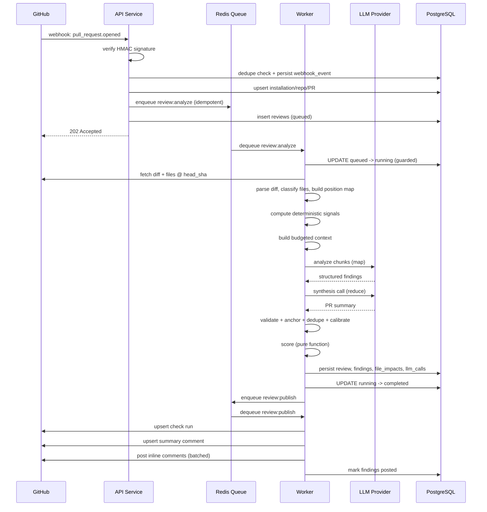
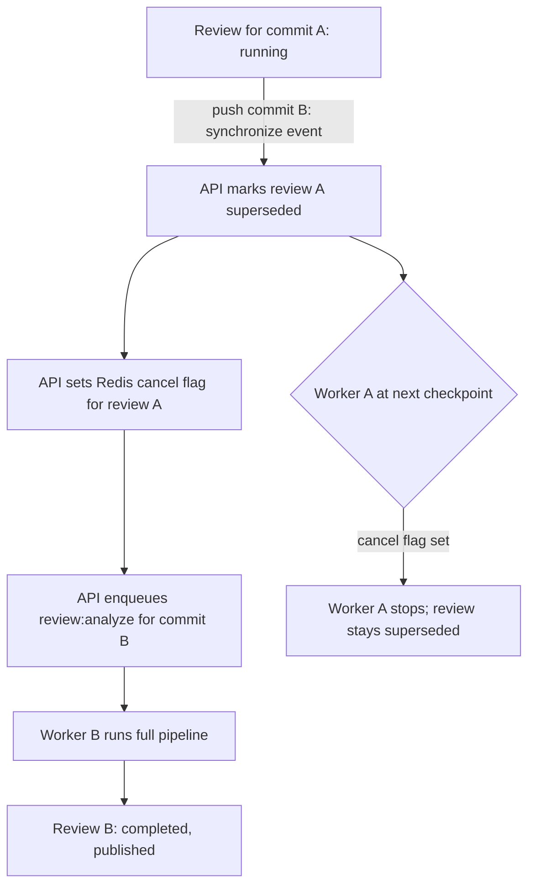
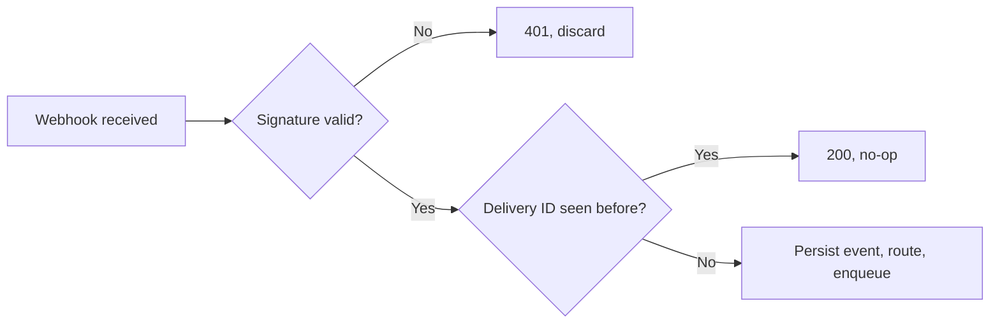
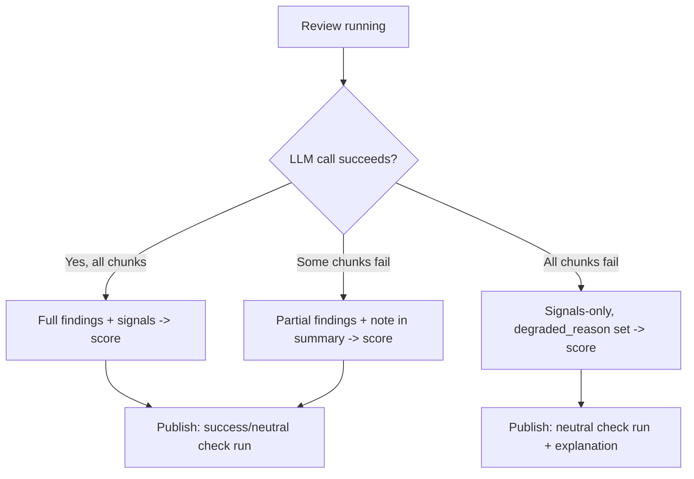
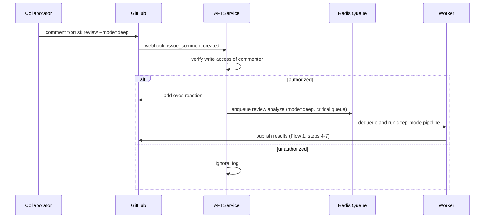
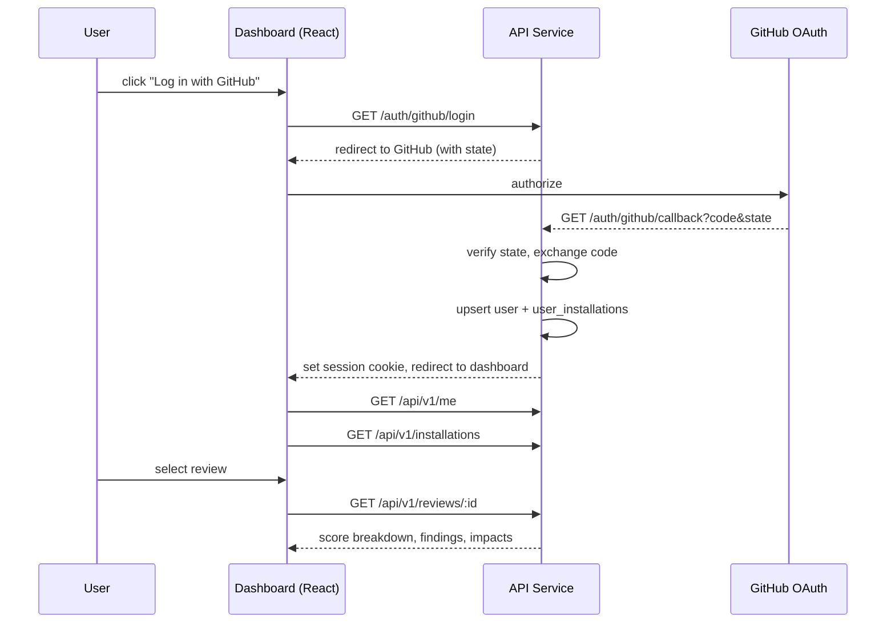

# User Flows — GitHub PR Risk Analyzer

**Derived from:** [PRD.md](./PRD.md) §7 · **Source of truth:** [`../pr-risk-analyzer-plan.md`](../pr-risk-analyzer-plan.md)
**Related:** [HLD.md](./HLD.md) · [API.md](./API.md) · [requirements.md](./requirements.md)

Each flow lists starting state, user action, system action, success state, and failure/alternative paths, with the governing `plan.md` section noted. MVP flows are marked **(MVP)**; the rest are **(V1)**.

---

## Flow 1 — PR Opened → Review Posted (Happy Path) (MVP)

**Starting state:** Repository has the GitHub App installed and active; a contributor opens a new pull request.

**User action:** Contributor opens the PR on GitHub.

**System action:**
1. GitHub sends a `pull_request` (`opened`) webhook.
2. API service verifies signature, dedupes on delivery ID, persists the event, upserts PR/repo rows.
3. API service derives the idempotency key and enqueues `review:analyze`, inserts a `reviews` row (`queued`), returns `202`.
4. Worker dequeues, transitions to `running`, fetches diff/files, builds context, computes deterministic signals.
5. Worker runs LLM analysis (map-reduce), validates/anchors findings, calibrates confidence.
6. Worker computes the risk score (pure function), persists everything, transitions to `completed`.
7. Worker enqueues `review:publish`; publisher creates the check run, posts the sticky summary comment, and posts capped inline comments.

**Success state:** Within ~60 seconds, the PR shows a completed check run with score/band, a summary comment, and inline comments on high-confidence anchored findings.

**Failure/alternative paths:**
- Signature invalid → `401`, nothing persisted (Flow ends at step 2; see Flow 6).
- PR is a draft/bot/oversized/inactive-repo → `status = skipped` with a reason; no check run created unless configured otherwise (`plan.md` §5 "Skip conditions").
- Any pipeline stage fails → see Flow 5 (Degraded Review).

---

## Flow 2 — New Push Supersedes an In-Flight Review (MVP)

**Starting state:** A review for PR #42 at commit A is `queued` or `running`.

**User action:** Contributor pushes a new commit (commit B) to the same PR.

**System action:**
1. GitHub sends `pull_request` (`synchronize`).
2. API service looks up in-flight reviews for PR #42, marks them `superseded`, sets a Redis cancellation flag.
3. API service enqueues a new `review:analyze` keyed on commit B's SHA.
4. The worker processing commit A checks the cancellation flag at its next checkpoint and stops, leaving the row `superseded` (already set by the API service; worker does not attempt to change it back).
5. The new review for commit B runs the full pipeline (Flow 1, steps 4–7).

**Success state:** Exactly one live, completed review exists for PR #42 (against commit B); the commit-A review is visibly `superseded` in the dashboard, and no comment was posted for it.

**Failure/alternative paths:**
- The commit-A worker is already in the publish stage when superseded — the publish task re-checks status immediately before posting and aborts (`plan.md` §8).
- Rapid-fire pushes (C, D, E within milliseconds) — each new `synchronize` supersedes all currently `queued`/`running` reviews for that PR; only the last one enqueued ends up live.

---

## Flow 3 — PR Closed Cancels In-Flight Review (MVP)

**Starting state:** A review for an open PR is `queued` or `running`.

**User action:** The PR is closed (merged or abandoned) on GitHub.

**System action:** API service receives `pull_request` (`closed`), updates the PR's `state`, and marks any in-flight review `superseded` with the cancellation flag set, exactly as in Flow 2.

**Success state:** No stale check run or comment is produced for work that no longer matters; the PR row reflects `closed`/`merged` state.

**Failure/alternative paths:** If the review had already reached `completed` and published before the close event arrived, the existing check run/comment remains — closing a PR does not retroactively delete prior results.

---

## Flow 4 — Webhook Redelivery (Idempotency) (MVP)

**Starting state:** GitHub previously delivered a `pull_request.opened` event and the system already processed it (a `webhook_events` row exists for that delivery ID).

**User action:** None — GitHub redelivers the same event (e.g., after a timeout it perceived, or an operator-triggered redelivery).

**System action:** API service reads the raw body, verifies signature (valid), checks `X-GitHub-Delivery` against `webhook_events` — finds an existing row.

**Success state:** API responds `200` immediately; no new `reviews` row, no new enqueue, no duplicate work of any kind.

**Failure/alternative paths:** If the *queue* guard is somehow bypassed (e.g., a manual retrigger with the same idempotency key), the database partial unique index on `reviews` is the second, independent guard preventing a duplicate live review.

---

## Flow 5 — Degraded Review When the LLM Is Unavailable (MVP)

**Starting state:** A review is `running`; the configured LLM provider is down or returning errors for every call.

**User action:** None — this is a backend resilience path triggered automatically.

**System action:**
1. Each chunk analysis call fails (timeout/5xx/429), retried per the retry policy, then tolerated as a failed chunk.
2. If **all** chunks fail, the worker skips straight to scoring using deterministic signals only (zero LLM-sourced findings).
3. Scoring proceeds normally — the blast-radius multiplier and any heuristic/static findings (test gaps, secrets, dependency risk) still contribute.
4. The review is marked `completed` with `degraded_reason` set (e.g., `llm_unavailable`).
5. The check run is published as `neutral` with a short human-readable explanation of the degradation.

**Success state:** The PR still receives a check run and a summary — never a stuck or missing result — clearly labeled as degraded.

**Failure/alternative paths:** If only *some* chunks fail, the review proceeds with partial LLM findings plus a note in the summary about the incomplete analysis, rather than discarding everything (`plan.md` §11 "Degradation ladder").

---

## Flow 6 — Webhook Signature Rejected (MVP)

**Starting state:** A POST arrives at `/webhooks/github` claiming to be a GitHub event.

**User action:** N/A (adversarial or misconfigured sender).

**System action:** Raw body is read; HMAC-SHA256 is computed with the webhook secret and compared via `hmac.Equal` against `X-Hub-Signature-256`. Mismatch → log, respond `401`, nothing is persisted.

**Success state (for the system):** No unauthenticated request can trigger analysis, spend, or a database write beyond the rejection log line.

**Failure/alternative paths:** A missing signature header is treated identically to a mismatched one — rejected, not defaulted to "trusted."

---

## Flow 7 — Manual Re-Analysis via Slash Command (V1)

**Starting state:** A PR has already been analyzed once; a reviewer wants a deeper pass.

**User action:** A repository collaborator with write access comments `/prrisk review --mode=deep` on the PR.

**System action:**
1. GitHub sends `issue_comment` (`created`); API service checks the issue is a PR and the body matches the command prefix.
2. Commenter's write access is verified; unauthorized commenters are silently ignored (not error-reported on the PR).
3. Mode is parsed (`deep`); an acknowledgment reaction (👀) is added to the comment.
4. A new review is enqueued on the `critical` priority queue with `trigger = manual_command`, `review_mode = deep`.
5. Pipeline proceeds as in Flow 1, using the deep-mode configuration (frontier model, full context, wide neighbor expansion).

**Success state:** A new, deeper review completes and publishes, without disturbing the automatically-triggered standard-mode review already on the PR (they are distinct `reviews` rows keyed by `(pr, head_sha, mode)`).

**Failure/alternative paths:**
- Unknown `--mode` value → falls back to the repo's default mode; a note is added to the comment reaction/response.
- Commenter lacks write access → command is ignored entirely.
- A review for `(pr, head_sha, deep)` is already in flight → the enqueue is a no-op (idempotency guard), not a duplicate deep review.

---

## Flow 8 — Dashboard Login and Review Inspection (V1)

**Starting state:** A user with GitHub access to at least one installation wants to inspect review history.

**User action:** User clicks "Log in with GitHub" on the dashboard.

**System action:**
1. Browser redirects to GitHub's OAuth authorize endpoint with a signed `state` parameter.
2. GitHub redirects back to `/auth/github/callback` with a code; API service verifies `state`, exchanges the code for a token, resolves the GitHub user, upserts `users`, resolves accessible `user_installations`.
3. A signed, `HttpOnly`, `Secure` session cookie is set.
4. User is redirected to the dashboard, which calls `GET /api/v1/me` and `GET /api/v1/installations`.
5. User selects an installation, browses `GET /api/v1/reviews` (filtered, paginated), and opens a specific review's detail page, which renders the score breakdown from `GET /api/v1/reviews/:id`.

**Success state:** User sees only reviews belonging to installations they can access, with a full explainable score breakdown.

**Failure/alternative paths:**
- `state` mismatch on callback → login rejected, user redirected to an error state, no session created.
- User requests a review ID belonging to an installation they can't access → `404` (see Flow 9).

---

## Flow 9 — Cross-Tenant Access Attempt (Denied) (V1)

**Starting state:** User A is authenticated and belongs to installation X only. Review R belongs to installation Y.

**User action:** User A requests `GET /api/v1/reviews/R` (e.g., by guessing or reusing a stale link).

**System action:** The store layer's tenant-scoping check joins the review through `installation_id` and compares against `user_installations` for the session user; no matching row is found.

**Success state:** API returns `404` (not `403`, to avoid confirming the review's existence) with the standard error envelope.

**Failure/alternative paths:** None — this is itself the guarded path; there is no scenario in which cross-tenant data is returned.

---

## Flow 10 — Re-Run a Review from the Dashboard (V1)

**Starting state:** User is viewing a completed review and wants to re-run it in a different mode (e.g., escalate `standard` to `security`).

**User action:** User selects a mode and clicks "Re-run."

**System action:**
1. `POST /api/v1/reviews/:id/rerun` with `{mode: "security"}`.
2. API checks for an in-flight review on the same PR; if one exists, returns `409 REVIEW_IN_FLIGHT`.
3. Otherwise, enqueues a new `review:analyze` with `trigger = reanalysis` and the requested mode, using the same idempotency scheme as any other trigger.
4. Pipeline proceeds as in Flow 1.

**Success state:** A new review row appears in the list; once complete, its results are independently browsable alongside the original.

**Failure/alternative paths:** Concurrent rerun requests for the same PR/mode/head-SHA collapse to a single enqueue via the standard idempotency guard (FR-011/FR-012), not a `409` race.

---

## Flow Coverage Summary

| Flow | Priority | Primary requirements |
|---|---|---|
| 1. PR opened → review posted | MVP | FR-001–FR-075 (full pipeline) |
| 2. Supersession on new push | MVP | FR-014, FR-011–FR-013 |
| 3. PR closed cancels review | MVP | FR-014 |
| 4. Webhook redelivery | MVP | FR-002, FR-011, FR-012 |
| 5. Degraded LLM review | MVP | FR-107, FR-042, NFR-013 |
| 6. Signature rejection | MVP | FR-001, NFR-006 |
| 7. Slash-command re-analysis | V1 | FR-010, FR-076–FR-080 |
| 8. Dashboard login | V1 | FR-086, FR-087 |
| 9. Cross-tenant denial | V1 | FR-091, NFR-007 |
| 10. Dashboard re-run | V1 | FR-090 |
